HeartDisease_EDA
================
Keyah Taneja
2024-12-10

Cardiovascular diseases (CVDs) are the number 1 cause of death globally,
taking an estimated 17.9 million lives each year, which accounts for 31%
of all deaths worldwide. Four out of 5CVD deaths are due to heart
attacks and strokes, and one-third of these deaths occur prematurely in
people under 70 years of age. Heart failure is a common event caused by
CVDs and this dataset contains 11 features that can be used to predict a
possible heart disease.

People with cardiovascular disease or who are at high cardiovascular
risk (due to the presence of one or more risk factors such as
hypertension, diabetes, hyperlipidaemia or already established disease)
need early detection and management wherein a machine learning model can
be of great help.

Dataset taken from:
<https://www.kaggle.com/datasets/fedesoriano/heart-failure-prediction/data>

``` r
# install.packages("knitr")
# install.packages("ggplot2")
# install.packages("plotly")
# install.packages("plotrix")
# install.packages("caret")
# install.packages("corrplot")
# install.packages("Hmisc")
# install.packages("car")
# install.packages("webshot2")
```

``` r
# Load necessary libraries
library(readr)
library(ggplot2)
```

    ## Warning: package 'ggplot2' was built under R version 4.4.2

``` r
library(knitr)
```

    ## Warning: package 'knitr' was built under R version 4.4.2

``` r
library(plotly)
```

    ## Warning: package 'plotly' was built under R version 4.4.2

    ## 
    ## Attaching package: 'plotly'

    ## The following object is masked from 'package:ggplot2':
    ## 
    ##     last_plot

    ## The following object is masked from 'package:stats':
    ## 
    ##     filter

    ## The following object is masked from 'package:graphics':
    ## 
    ##     layout

``` r
library(tidyr)
```

    ## Warning: package 'tidyr' was built under R version 4.4.2

``` r
library(plotrix)
library(ggcorrplot)
library(caret)
```

    ## Warning: package 'caret' was built under R version 4.4.2

    ## Loading required package: lattice

``` r
library(pROC)
```

    ## Warning: package 'pROC' was built under R version 4.4.2

    ## Type 'citation("pROC")' for a citation.

    ## 
    ## Attaching package: 'pROC'

    ## The following objects are masked from 'package:stats':
    ## 
    ##     cov, smooth, var

``` r
library(corrplot)
```

    ## Warning: package 'corrplot' was built under R version 4.4.2

    ## corrplot 0.95 loaded

``` r
library(Hmisc)
```

    ## Warning: package 'Hmisc' was built under R version 4.4.2

    ## 
    ## Attaching package: 'Hmisc'

    ## The following object is masked from 'package:plotly':
    ## 
    ##     subplot

    ## The following objects are masked from 'package:base':
    ## 
    ##     format.pval, units

``` r
library(car)
```

    ## Warning: package 'car' was built under R version 4.4.2

    ## Loading required package: carData

    ## Warning: package 'carData' was built under R version 4.4.2

``` r
library(webshot2)
```

    ## Warning: package 'webshot2' was built under R version 4.4.2

``` r
# Read the CSV file
heart_data <- read_csv("HeartDisease_Data.csv")
```

    ## Rows: 918 Columns: 12
    ## ── Column specification ────────────────────────────────────────────────────────
    ## Delimiter: ","
    ## chr (5): Sex, ChestPainType, RestingECG, ExerciseAngina, ST_Slope
    ## dbl (7): Age, RestingBP, Cholesterol, FastingBS, MaxHR, Oldpeak, HeartDisease
    ## 
    ## ℹ Use `spec()` to retrieve the full column specification for this data.
    ## ℹ Specify the column types or set `show_col_types = FALSE` to quiet this message.

``` r
# Display the first few rows of the dataframe
head(heart_data)
```

    ## # A tibble: 6 × 12
    ##     Age Sex   ChestPainType RestingBP Cholesterol FastingBS RestingECG MaxHR
    ##   <dbl> <chr> <chr>             <dbl>       <dbl>     <dbl> <chr>      <dbl>
    ## 1    40 M     ATA                 140         289         0 Normal       172
    ## 2    49 F     NAP                 160         180         0 Normal       156
    ## 3    37 M     ATA                 130         283         0 ST            98
    ## 4    48 F     ASY                 138         214         0 Normal       108
    ## 5    54 M     NAP                 150         195         0 Normal       122
    ## 6    39 M     NAP                 120         339         0 Normal       170
    ## # ℹ 4 more variables: ExerciseAngina <chr>, Oldpeak <dbl>, ST_Slope <chr>,
    ## #   HeartDisease <dbl>

We have the following variables:

1.  Age: the age of each participant \[years\]
2.  Sex: the sex of each participant \[M: Male, F: Female\]
3.  Chest Pain Type: we have 4 types of chest pain: ATA: atypical angina
    NAP: non-anginal pain ASY: asymptomatic TA: typical angina
4.  Resting BP: blood-pressure level, ideal between 90-120 mmHg \[mm
    Hg\]
5.  Cholesterol: cholesterol level \[mm/dl\]
6.  FastingBS: fasting blood sugar level \[1: FastingBS \> 120 mg/dl,
    0:otherwise\]
7.  Resting ECG: electrical activity of heart at rest, there are 3
    values: Normal: normal activity ST: ST segment \[St-T wave
    abnormality\] LVH: left ventricular hypertrophy (LVH)
8.  MaxHR: maximum heart rate
9.  Exercise Angine: pain while exercising \[Y: yes, N: no\]
10. Oldpeak: ST\[numeric value measured in depression\]
11. ST_slope: slope for the ST
12. Heart Disease: Presence (1) of heart disease and (0) of heart
    disease

Now, we will look at the summary of the data

``` r
# Display structure of the data
str(heart_data)
```

    ## spc_tbl_ [918 × 12] (S3: spec_tbl_df/tbl_df/tbl/data.frame)
    ##  $ Age           : num [1:918] 40 49 37 48 54 39 45 54 37 48 ...
    ##  $ Sex           : chr [1:918] "M" "F" "M" "F" ...
    ##  $ ChestPainType : chr [1:918] "ATA" "NAP" "ATA" "ASY" ...
    ##  $ RestingBP     : num [1:918] 140 160 130 138 150 120 130 110 140 120 ...
    ##  $ Cholesterol   : num [1:918] 289 180 283 214 195 339 237 208 207 284 ...
    ##  $ FastingBS     : num [1:918] 0 0 0 0 0 0 0 0 0 0 ...
    ##  $ RestingECG    : chr [1:918] "Normal" "Normal" "ST" "Normal" ...
    ##  $ MaxHR         : num [1:918] 172 156 98 108 122 170 170 142 130 120 ...
    ##  $ ExerciseAngina: chr [1:918] "N" "N" "N" "Y" ...
    ##  $ Oldpeak       : num [1:918] 0 1 0 1.5 0 0 0 0 1.5 0 ...
    ##  $ ST_Slope      : chr [1:918] "Up" "Flat" "Up" "Flat" ...
    ##  $ HeartDisease  : num [1:918] 0 1 0 1 0 0 0 0 1 0 ...
    ##  - attr(*, "spec")=
    ##   .. cols(
    ##   ..   Age = col_double(),
    ##   ..   Sex = col_character(),
    ##   ..   ChestPainType = col_character(),
    ##   ..   RestingBP = col_double(),
    ##   ..   Cholesterol = col_double(),
    ##   ..   FastingBS = col_double(),
    ##   ..   RestingECG = col_character(),
    ##   ..   MaxHR = col_double(),
    ##   ..   ExerciseAngina = col_character(),
    ##   ..   Oldpeak = col_double(),
    ##   ..   ST_Slope = col_character(),
    ##   ..   HeartDisease = col_double()
    ##   .. )
    ##  - attr(*, "problems")=<externalptr>

``` r
# Display summary statistics
summary(heart_data)
```

    ##       Age            Sex            ChestPainType        RestingBP    
    ##  Min.   :28.00   Length:918         Length:918         Min.   :  0.0  
    ##  1st Qu.:47.00   Class :character   Class :character   1st Qu.:120.0  
    ##  Median :54.00   Mode  :character   Mode  :character   Median :130.0  
    ##  Mean   :53.51                                         Mean   :132.4  
    ##  3rd Qu.:60.00                                         3rd Qu.:140.0  
    ##  Max.   :77.00                                         Max.   :200.0  
    ##   Cholesterol      FastingBS       RestingECG            MaxHR      
    ##  Min.   :  0.0   Min.   :0.0000   Length:918         Min.   : 60.0  
    ##  1st Qu.:173.2   1st Qu.:0.0000   Class :character   1st Qu.:120.0  
    ##  Median :223.0   Median :0.0000   Mode  :character   Median :138.0  
    ##  Mean   :198.8   Mean   :0.2331                      Mean   :136.8  
    ##  3rd Qu.:267.0   3rd Qu.:0.0000                      3rd Qu.:156.0  
    ##  Max.   :603.0   Max.   :1.0000                      Max.   :202.0  
    ##  ExerciseAngina        Oldpeak          ST_Slope          HeartDisease   
    ##  Length:918         Min.   :-2.6000   Length:918         Min.   :0.0000  
    ##  Class :character   1st Qu.: 0.0000   Class :character   1st Qu.:0.0000  
    ##  Mode  :character   Median : 0.6000   Mode  :character   Median :1.0000  
    ##                     Mean   : 0.8874                      Mean   :0.5534  
    ##                     3rd Qu.: 1.5000                      3rd Qu.:1.0000  
    ##                     Max.   : 6.2000                      Max.   :1.0000

``` r
#Counting the number of null values in each column
colSums(is.na(heart_data))
```

    ##            Age            Sex  ChestPainType      RestingBP    Cholesterol 
    ##              0              0              0              0              0 
    ##      FastingBS     RestingECG          MaxHR ExerciseAngina        Oldpeak 
    ##              0              0              0              0              0 
    ##       ST_Slope   HeartDisease 
    ##              0              0

As we can see, there are no null values in our dataset.

We will begin by visualizing the numerical data, which will give insight
into if the data is normally distributed, the range and spread.

## EDA

``` r
# Create the long-format data for easier plotting
heart_data_long <- heart_data %>%
  gather(key = "variable", value = "value", Age, RestingBP, Cholesterol, MaxHR, Oldpeak)

# Create the plot with faceting
plot <- ggplot(heart_data_long, aes(x = value, fill = variable)) +
  geom_density(alpha = 0.7) + 
  labs(title = "Probability Density Functions of Multiple Columns",
       x = "Value", y = "Density") +
  theme_minimal() +
  theme(
    axis.text.x = element_text(size = 7, angle = 350, vjust = -1, color = "black"),
    panel.spacing = unit(2, "lines")
  ) +
  facet_wrap(~ variable, scales = "free")

# Convert to interactive plot with hover information
interactive_plot <- ggplotly(plot)

# Display the interactive plot
interactive_plot
```

    ## file:///C:\Users\keyah\AppData\Local\Temp\Rtmp6JjqdZ\file6ae851b4eb\widget6ae858217e7e.html screenshot completed

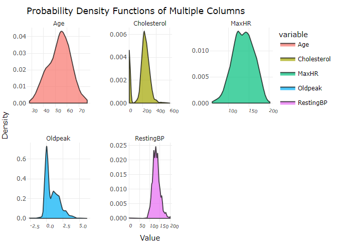<!-- -->

Age: This suggests that most individuals in your data are of a middle to
older age, with fewer younger individuals. The slight skew indicates a
gradual tapering toward older ages.

Cholesterol: The two peaks might correspond to two distinct subgroups in
your population, perhaps differing in dietary habits, medical
conditions, or genetic factors. A closer look at the dataset reveals
that there are a few patients with 0 cholesterol level, which means the
data is not collected properly. For the purpose of this analysis, we
will not be removing them.

Maximum Heart Rate: A consistently high distribution indicates that most
individuals have a similar range of maximum heart rates.

OldPeak: Most individuals have a low OldPeak value, indicating a low ST
depression, which suggests fewer instances of exercise-induced ischemia.

Resting BP: Multiple peaks could indicate subgroups within your data.
For instance, these could reflect individuals with low, normal, and high
blood pressure ranges.

These give us ideas about the distribution of the variables.

Now we will create pie charts to view the distribution of our
categorical variables.

``` r
# Ensure the 'Sex' column remains as character and not factor
heart_data$Sex <- as.character(heart_data$Sex)

# Calculate the counts for each category in 'Sex' column
sex_counts <- table(heart_data$Sex)


# Create the pie chart
fig <- plot_ly(
  labels = names(sex_counts), 
  values = sex_counts, 
  type = 'pie', 
  textinfo = 'label+percent',   # Display label and percentage
  hoverinfo = 'label+percent',  # Display label and percentage on hover
  marker = list(colors = c('#ff9999', '#66b3ff')),
  height = 350,  # Adjust the height
  width = 350 
)

# Customize the layout (Optional: simulate 3D effect)
fig <- fig %>% layout(
  title = "Pie Chart of Sex Distribution",
  showlegend = TRUE
  
)

# Display the pie chart
fig
```

    ## file:///C:\Users\keyah\AppData\Local\Temp\Rtmp6JjqdZ\file6ae83e962908\widget6ae885f6d49.html screenshot completed

<!-- -->

``` r
heart_data$ChestPainType <- as.character(heart_data$ChestPainType)

# Calculate the counts for each category in 'ChestPainType' column
chest_pain_counts <- table(heart_data$ChestPainType)

# Create the pie chart
fig <- plot_ly(
  labels = names(chest_pain_counts), 
  values = chest_pain_counts, 
  type = 'pie', 
  textinfo = 'label+percent',   # Display label and percentage
  hoverinfo = 'label+percent',  # Display label and percentage on hover
  marker = list(colors = c('#ff9999', '#66b3ff', '#99ff99', '#ffcc99')),
  height = 350,  # Adjust the height
  width = 350
)

# Customize the layout (Optional: simulate 3D effect)
fig <- fig %>% layout(
  title = "Pie Chart of Chest Pain Type Distribution",
  showlegend = TRUE
)

# Display the pie chart
fig
```

    ## file:///C:\Users\keyah\AppData\Local\Temp\Rtmp6JjqdZ\file6ae86c5d605c\widget6ae8c2b214b.html screenshot completed

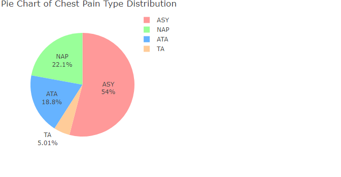<!-- -->

``` r
heart_data$FastingBS <- as.character(heart_data$FastingBS)
# Calculate the counts for each category in 'Fasting BS' column
Fasting_BS_counts <- table(heart_data$FastingBS)

labels <- ifelse(names(Fasting_BS_counts) == "1", "Yes", "No")

# Create the pie chart
fig <- plot_ly(
  labels = labels, 
  values = Fasting_BS_counts, 
  type = 'pie', 
  textinfo = 'label+percent',   # Display label and percentage
  hoverinfo = 'label+percent',  # Display label and percentage on hover
  marker = list(colors = c('#ff9999', '#66b3ff')),
  height = 350,  # Adjust the height
  width = 350
)

# Customize the layout (Optional: simulate 3D effect)
fig <- fig %>% layout(
  title = "Pie Chart of Fasting Blood Sugar Distribution",
  showlegend = TRUE
)

# Display the pie chart
fig
```

    ## file:///C:\Users\keyah\AppData\Local\Temp\Rtmp6JjqdZ\file6ae823f8ef4\widget6ae82fe81846.html screenshot completed

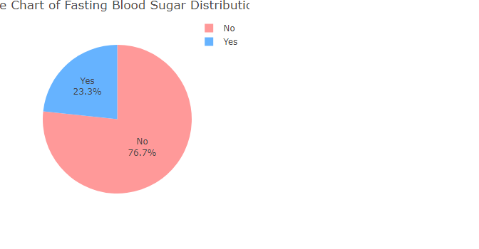<!-- -->

``` r
heart_data$RestingECG <- as.character(heart_data$RestingECG)
# Calculate the counts for each category in 'Resting ECG' column

Resting_ECG_counts <- table(heart_data$RestingECG)

# Create the pie chart
fig <- plot_ly(
  labels = names(Resting_ECG_counts), 
  values = Resting_ECG_counts, 
  type = 'pie', 
  textinfo = 'label+percent',   # Display label and percentage
  hoverinfo = 'label+percent',  # Display label and percentage on hover
  marker = list(colors = c('#ff9999', '#66b3ff', '#99ff99')),
  height = 350,  # Adjust the height
  width = 350
)

# Customize the layout (Optional: simulate 3D effect)
fig <- fig %>% layout(
  title = "Pie Chart of Resting ECG Distribution",
  showlegend = TRUE
)

# Display the pie chart
fig
```

    ## file:///C:\Users\keyah\AppData\Local\Temp\Rtmp6JjqdZ\file6ae815f66313\widget6ae868fd316f.html screenshot completed

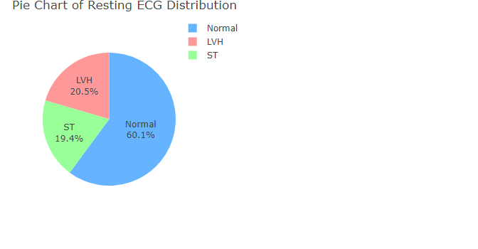<!-- -->

``` r
heart_data$ExerciseAngina <- as.character(heart_data$ExerciseAngina)

# Calculate the counts for each category in 'Exercise Angina' column
Exercise_Angina_counts <- table(heart_data$ExerciseAngina)

labels <- ifelse(names(Exercise_Angina_counts) == "Y", "Yes", "No")

# Create the pie chart
fig <- plot_ly(
  labels = labels, 
  values = Exercise_Angina_counts, 
  type = 'pie', 
  textinfo = 'label+percent',   # Display label and percentage
  hoverinfo = 'label+percent',  # Display label and percentage on hover
  marker = list(colors = c('#ff9999', '#66b3ff')),
  height = 350,  # Adjust the height
  width = 350
)

# Customize the layout (Optional: simulate 3D effect)
fig <- fig %>% layout(
  title = "Pie Chart of Exercise Angina Type Distribution",
  showlegend = TRUE
)

# Display the pie chart
fig
```

    ## file:///C:\Users\keyah\AppData\Local\Temp\Rtmp6JjqdZ\file6ae870c45266\widget6ae8139360bf.html screenshot completed

<!-- -->

``` r
heart_data$ST_Slope <- as.character(heart_data$ST_Slope)

# Calculate the counts for each category in 'ST_Slope' column
ST_Slope_counts <- table(heart_data$ST_Slope)

# Create the pie chart
fig <- plot_ly(
  labels = names(ST_Slope_counts), 
  values = ST_Slope_counts, 
  type = 'pie', 
  textinfo = 'label+percent',   # Display label and percentage
  hoverinfo = 'label+percent',  # Display label and percentage on hover
  marker = list(colors = c('#ff9999', '#66b3ff', '#99ff99')),
  height = 350,  # Adjust the height
  width = 350
)

# Customize the layout (Optional: simulate 3D effect)
fig <- fig %>% layout(
  title = "Pie Chart of ST Slope Distribution",
  showlegend = TRUE
)

# Display the pie chart
fig
```

    ## file:///C:\Users\keyah\AppData\Local\Temp\Rtmp6JjqdZ\file6ae855e42a52\widget6ae871ac21a1.html screenshot completed

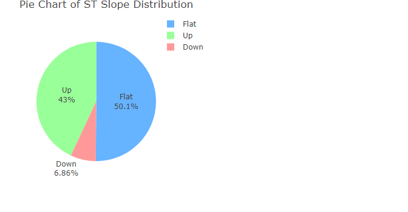<!-- -->

``` r
# Calculate the counts for each category in 'HeartDisease' column
Heart_Disease_counts <- table(heart_data$HeartDisease)

labels <- ifelse(names(Heart_Disease_counts) == "1", "Yes", "No")


# Create the pie chart
fig <- plot_ly(
  labels = labels, 
  values = Heart_Disease_counts, 
  type = 'pie', 
  textinfo = 'label+percent',   # Display label and percentage
  hoverinfo = 'label+percent',  # Display label and percentage on hover
  marker = list(colors = c('#ff9999', '#66b3ff')),
  height = 350,  # Adjust the height
  width = 350
)

# Customize the layout (Optional: simulate 3D effect)
fig <- fig %>% layout(
  title = "Pie Chart of Heart Disease Distribution",
  showlegend = TRUE
)

# Display the pie chart
fig
```

    ## file:///C:\Users\keyah\AppData\Local\Temp\Rtmp6JjqdZ\file6ae84b6e2b7f\widget6ae887e4ede.html screenshot completed

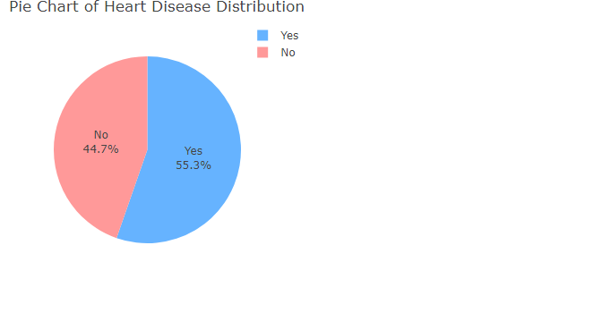<!-- -->

Now we will create violin plots to visualize if there are any stark
difference between those with heart diseases and those without, based on
age, sex and cholesterol levels.

``` r
ggplot(heart_data, aes(x = factor(HeartDisease, labels = c("No", "Yes")), 
                       y = Age, 
                       fill = factor(HeartDisease, labels = c("No", "Yes")))) +
  geom_violin(trim = FALSE) + 
  labs(title = "Age Distribution by Heart Disease Status", 
       x = "Heart Disease", 
       y = "Age") +
  scale_fill_manual(values = c("lightblue", "lightcoral"), 
                    name = "Heart Disease", 
                    labels = c("No", "Yes")) +
  theme_minimal()
```

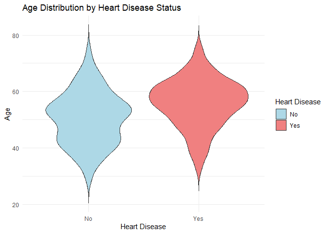<!-- -->

As we can see, there is no stark difference in the age groups of
patients with vs without heart disease.

``` r
heart_data$Sex <- ifelse(heart_data$Sex == "M", 1, 0)

ggplot(heart_data, aes(factor(HeartDisease, labels = c("No", "Yes")), y = Sex, fill = factor(HeartDisease, labels = c("No", "Yes")))) +
  geom_violin(trim = FALSE) + 
  labs(title = "Sex Distribution by Heart Disease Status", 
       x = "Heart Disease", 
       y = "Sex") +
  scale_fill_manual(values = c("lightblue", "lightcoral"), 
                    name = "Heart Disease", 
                    labels = c("No", "Yes")) +
  theme_minimal()
```

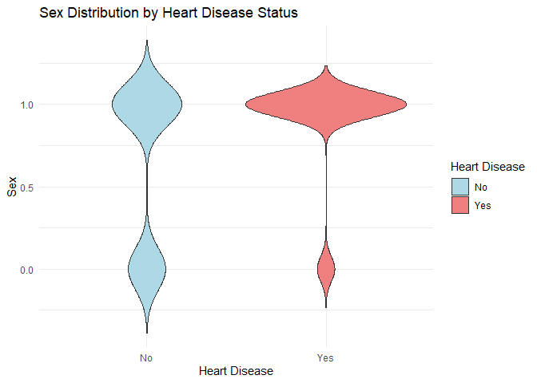<!-- -->

Through the plot we can see that more males test positive for heart
diseases. However, we must keep in mind that our dataset has a higher
percentage of males which could influence the overall model.

We will now use correlation matrix to visualize the relation between
heart disease and different variables.

First we will convert the categorical variables into numeric variables.

``` r
heart_data$ChestPainType <- as.numeric(factor(heart_data$ChestPainType, levels = c('ATA', 'NAP', 'ASY', 'TA'))) #assigned vales from 1-4
heart_data$RestingECG <- as.numeric(factor(heart_data$RestingECG, levels = c('Normal', 'ST', 'LVH'))) #assigned vales from 1-3
heart_data$ExerciseAngina <- ifelse(heart_data$ExerciseAngina == "Y", 1, 0) #yes is indicated by 1
heart_data$ST_Slope <- as.numeric(factor(heart_data$ST_Slope, levels = c('Up', 'Flat', 'Down'))) #assigned vales from 1-3
```

``` r
binary_vars <- c("Sex", "ExerciseAngina", "FastingBS", "RestingECG", "ST_Slope")
continuous_vars <- c("Age", "RestingBP", "Cholesterol", "MaxHR", "Oldpeak")
binary_data <- heart_data[, binary_vars]

continuous_data <- heart_data[, continuous_vars]
combined_data <- cbind(heart_data[, c(binary_vars, "HeartDisease")], continuous_data)
combined_data$HeartDisease <- as.numeric(as.character(combined_data$HeartDisease))
combined_data$FastingBS <- as.numeric(as.character(combined_data$FastingBS))

combined_cor_matrix <- cor(combined_data)

corrplot(combined_cor_matrix, method = "color", type = "lower",
         tl.col="black",
         tl.cex=0.8,
         outline=TRUE)        
```

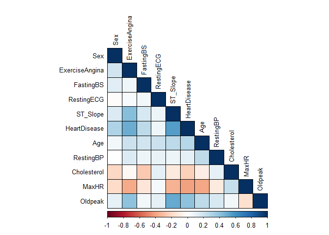<!-- -->

This helps us visualize the correlations between different variables.
There are a few variables which have high correlations, we will check
for multi-collinearity.

## Creating the model

To make our model, we will begin by dividing our sample into training vs
test data.

``` r
# Set a seed for reproducibility
set.seed(42)

# Create the index for the training set (80% of the data)
trainIndex <- createDataPartition(heart_data$HeartDisease, p = 0.8, list = FALSE)

# Subset the data into training and testing sets
train_data <- heart_data[trainIndex, ]
test_data <- heart_data[-trainIndex, ]
```

``` r
logit_model <- glm(HeartDisease ~ ., data = train_data, family = binomial)
summary(logit_model)
```

    ## 
    ## Call:
    ## glm(formula = HeartDisease ~ ., family = binomial, data = train_data)
    ## 
    ## Coefficients:
    ##                 Estimate Std. Error z value Pr(>|z|)    
    ## (Intercept)    -4.611962   1.401873  -3.290  0.00100 ** 
    ## Age             0.003356   0.013517   0.248  0.80390    
    ## Sex             1.154096   0.279916   4.123 3.74e-05 ***
    ## ChestPainType   0.658845   0.133438   4.937 7.91e-07 ***
    ## RestingBP       0.006373   0.006208   1.026  0.30467    
    ## Cholesterol    -0.002382   0.001110  -2.146  0.03186 *  
    ## FastingBS1      1.117120   0.284266   3.930 8.50e-05 ***
    ## RestingECG      0.086752   0.139411   0.622  0.53376    
    ## MaxHR          -0.013182   0.004927  -2.676  0.00746 ** 
    ## ExerciseAngina  1.110621   0.249610   4.449 8.61e-06 ***
    ## Oldpeak         0.228098   0.127040   1.795  0.07258 .  
    ## ST_Slope        1.583659   0.220880   7.170 7.51e-13 ***
    ## ---
    ## Signif. codes:  0 '***' 0.001 '**' 0.01 '*' 0.05 '.' 0.1 ' ' 1
    ## 
    ## (Dispersion parameter for binomial family taken to be 1)
    ## 
    ##     Null deviance: 1016.2  on 734  degrees of freedom
    ## Residual deviance:  555.4  on 723  degrees of freedom
    ## AIC: 579.4
    ## 
    ## Number of Fisher Scoring iterations: 5

``` r
exp(coef(logit_model))
```

    ##    (Intercept)            Age            Sex  ChestPainType      RestingBP 
    ##    0.009932314    1.003362052    3.171154666    1.932558637    1.006393107 
    ##    Cholesterol     FastingBS1     RestingECG          MaxHR ExerciseAngina 
    ##    0.997620703    3.056041227    1.090625671    0.986904929    3.036244315 
    ##        Oldpeak       ST_Slope 
    ##    1.256208203    4.872752069

#### Interpretation:

1.  Sex: The positive coefficient indicates that being male (since we
    coded Sex as 1 for males) increases the odds of having heart disease
    compared to being female. exp(1.154096) = 3.17, meaning males are
    3.17 times more likely to have heart disease compared to females.

2.  Chest Pain: A higher value suggests that different types of chest
    pain (other than the baseline “ASY” type) increase the likelihood of
    heart disease. exp(0.658845) = 1.93, meaning individuals with chest
    pain (other than asymptomatic) are 1.93 times more likely to have
    heart disease.

3.  Cholesterol: The negative sign indicates that higher cholesterol
    levels reduce the odds of having heart disease, which might be
    surprising and could suggest that higher cholesterol could be
    associated with a lower chance of heart disease in this dataset.
    Further exploration may be required.

4.  Fasting BS: Presence of fasting blood sugar level significantly
    increases the odds of heart disease.

5.  MaxHR: The negative coefficient indicates that as the maximum heart
    rate increases, the odds of heart disease decrease. This is in line
    with the expectation that higher fitness levels (reflected by higher
    maximum heart rate) would lower the likelihood of heart disease.
    0.99, meaning for each unit increase in MaxHR, the odds of heart
    disease decrease by 1%.

6.  Exercise Angina: The positive coefficient suggests that individuals
    who experience pain while exercising are much more likely to have
    heart disease.

7.  ST_Slope: The positive coefficient indicates that a steeper slope of
    the ST segment is associated with higher odds of heart disease.

``` r
vif(logit_model)
```

    ##            Age            Sex  ChestPainType      RestingBP    Cholesterol 
    ##       1.306358       1.056964       1.044073       1.119566       1.206853 
    ##      FastingBS     RestingECG          MaxHR ExerciseAngina        Oldpeak 
    ##       1.087890       1.104933       1.229923       1.226918       1.267993 
    ##       ST_Slope 
    ##       1.220144

Since the VIF values are well below the critical value of 5 (or even
10), there doesn’t appear to be any severe multicollinearity in the
logistic regression model.

We can remove the non-significant variables:

``` r
# Removing non-significant variables based on p-value > 0.05
logit_model_refined <- glm(HeartDisease ~ Sex + ChestPainType + FastingBS + MaxHR + 
                            ExerciseAngina + ST_Slope, data = train_data, family = binomial)
summary(logit_model_refined)
```

    ## 
    ## Call:
    ## glm(formula = HeartDisease ~ Sex + ChestPainType + FastingBS + 
    ##     MaxHR + ExerciseAngina + ST_Slope, family = binomial, data = train_data)
    ## 
    ## Coefficients:
    ##                 Estimate Std. Error z value Pr(>|z|)    
    ## (Intercept)    -3.994480   0.873713  -4.572 4.83e-06 ***
    ## Sex             1.223685   0.272661   4.488 7.19e-06 ***
    ## ChestPainType   0.719108   0.130368   5.516 3.47e-08 ***
    ## FastingBS1      1.312230   0.273040   4.806 1.54e-06 ***
    ## MaxHR          -0.014922   0.004557  -3.275  0.00106 ** 
    ## ExerciseAngina  1.200389   0.236091   5.084 3.69e-07 ***
    ## ST_Slope        1.709769   0.202716   8.434  < 2e-16 ***
    ## ---
    ## Signif. codes:  0 '***' 0.001 '**' 0.01 '*' 0.05 '.' 0.1 ' ' 1
    ## 
    ## (Dispersion parameter for binomial family taken to be 1)
    ## 
    ##     Null deviance: 1016.17  on 734  degrees of freedom
    ## Residual deviance:  564.99  on 728  degrees of freedom
    ## AIC: 578.99
    ## 
    ## Number of Fisher Scoring iterations: 5

We can also check if there is significant contribution by the variables
by running a chi-sq test for the null deviance and residual deviance.

``` r
pchisq(1016.17 - 564.99, df = 734 - 728, lower.tail = FALSE)
```

    ## [1] 2.735066e-94

The predictors in the model significantly improve its fit compared to
the null model, and the likelihood that this improvement is due to
random chance is essentially zero.

In practical terms, the predictors in the model have a strong and
statistically significant effect on the outcome variable.

## Testing the model

Now, we will check the model on the test data:

``` r
predictions <- predict(logit_model_refined, test_data, type = "response")
predicted_class <- ifelse(predictions > 0.5, 1, 0)

# Create confusion matrix
conf_matrix <- table(predicted_class, test_data$HeartDisease)

# Convert confusion matrix to data frame for ggplot2
conf_matrix_df <- as.data.frame(conf_matrix)
colnames(conf_matrix_df) <- c("Predicted", "Actual", "Frequency")

ggplot(conf_matrix_df, aes(x = Actual, y = Predicted, fill = Frequency)) +
  geom_tile(color = "white")  +
  geom_text(aes(label = Frequency), vjust = 1, color="white") + 
  theme_minimal() +
  labs(title = "Confusion Matrix Heatmap", x = "Actual Values", y = "Predicted Values") +
  theme(axis.text.x = element_text(angle = 45, hjust = 1))
```

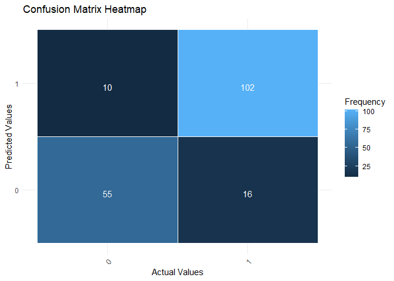<!-- -->

As we can see, 102 data were correctly predicted by our model to have
heart diseases, whereas 55 were correctly predicted to not have heart
diseases.

There were 26 cases that were not categorized correctly by the model.

We can calculate the accuracy and precision scores:

``` r
accuracy <- sum(diag(conf_matrix)) / sum(conf_matrix)
print(paste("Accuracy:", accuracy))
```

    ## [1] "Accuracy: 0.85792349726776"

``` r
precision <- diag(conf_matrix) / rowSums(conf_matrix)
print("Precision:")
```

    ## [1] "Precision:"

``` r
precision
```

    ##         0         1 
    ## 0.7746479 0.9107143

Our accuracy is 85.7% ie majority of the patients were categorized
correctly. The precision ie correct categorization for each sentiment is
also described. We had more misses in the absence of heart rates.

``` r
roc_curve <- roc(test_data$HeartDisease, predictions)
```

    ## Setting levels: control = 0, case = 1

    ## Setting direction: controls < cases

``` r
plot(roc_curve)
```

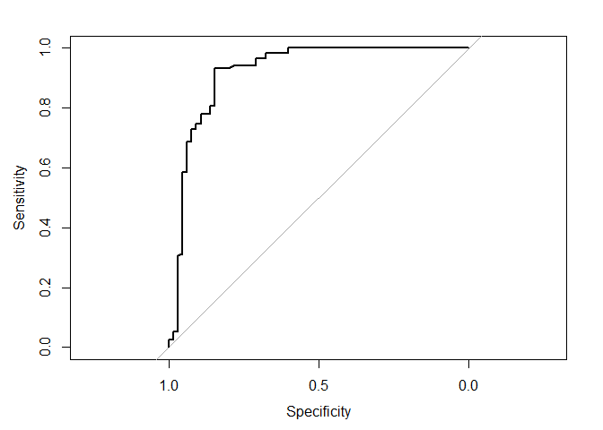<!-- -->

``` r
auc(roc_curve)
```

    ## Area under the curve: 0.9197

The ROC curve was plotted to assess the model’s ability to distinguish
between the two classes (positive vs. negative). The curve demonstrates
the relationship between the True Positive Rate (sensitivity) and the
False Positive Rate (1 - specificity) at various thresholds.

AUC = 91.7 indicates that our model can correctly distinguish between
the two classes about 91.97% of the time when comparing randomly
selected positive and negative cases.

The high AUC value further supports the effectiveness of the model in
terms of classification accuracy. The ROC curve and AUC indicate that
the model is highly reliable, with a very low chance of misclassifying
instances.

### Conclusion

In this project, a comprehensive analysis was conducted to assess the
predictive power of the model in classifying heart disease outcomes.
Various statistical methods and performance metrics were used to
evaluate the model’s ability to distinguish between individuals with and
without heart disease, offering reliable predictions with a 91.97%
accuracy in ranking positive cases higher than negative ones.

While the model’s performance was promising, several important
limitations should be considered:

1.  Model Complexity and AIC:

The AIC value of 578.99 indicates that while the model fits the data
well, there may be room for improvement in terms of balancing model
complexity and predictive accuracy. The relatively high AIC suggests the
model may have overfitted or incorporated too many predictors. A more
refined model could potentially improve performance by reducing the
number of features or applying regularization techniques.

2.  Overfitting Risk:

Although the AUC value is high, the model may still be at risk of
overfitting, especially since it was trained on a relatively small or
biased dataset. Future cross-validation or testing on an independent
dataset would help confirm the model’s generalizability to unseen data.

3.  Dataset Limitations:

The dataset used in this analysis may not fully capture the diverse
range of individuals who may present with heart disease. Expanding the
dataset to include more diverse populations, or incorporating additional
clinical variables, could enhance the model’s robustness and
applicability.

## Future Recommendations:

**Model Optimization**: Consider experimenting with different models
(e.g., Random Forests, Support Vector Machines) or tuning
hyperparameters to improve AIC and overall performance.

**Feature Selection**: Reevaluate the set of features used in the model
to potentially reduce dimensionality and improve AIC while maintaining
performance.

**Cross-Validation**: Implement k-fold cross-validation to ensure that
the model generalizes well to new data and is not overfitting.

**Data Augmentation**: Address missing data by considering imputation
techniques or collecting more data to reduce potential biases and
improve feature reliability.
